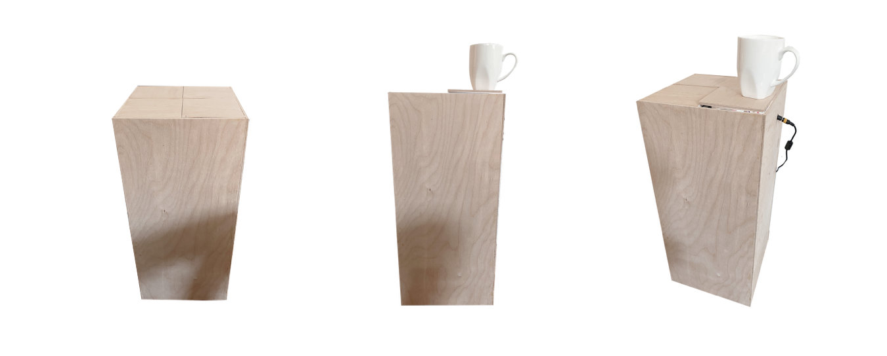

# Elevate
## About
Elevate is living furniture for your smart home that acknowledges your actions and highlights your daily routines.

Elevate consists of four panels, each equipped with a Force-Sensitive Resistor, LEDs, and a Stepper Motor; all controlled by stepper drivers, an Arduino Nano, and an Arduino Uno.
### Design

### Schematic

### Rendering

### Prototype

